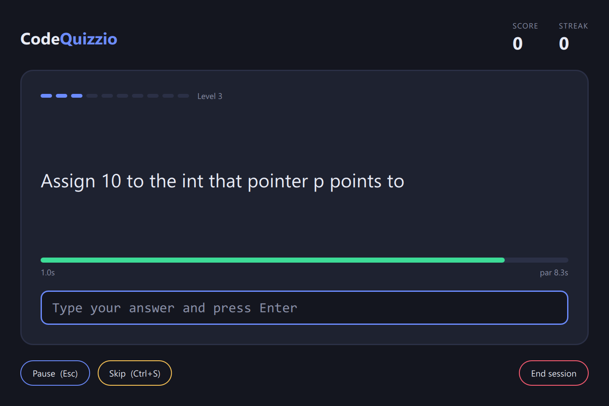

# CodeQuizzio

A fast-paced desktop typing game for drilling C++ syntax, a bit like Duolingo for code.

You get a short prompt like *"Include the iostream header"* or *"Write a range-based for loop over vector v"*, and you type the answer from memory as fast as you can. Faster answers on harder questions score more. The idea comes from a simple observation: syntax sticks when you write it over and over, so this app makes that repetition quick and a little addictive.



## Features

- **Short, syntax-level questions.** One-liners, not whole programs. 65 C++ questions so far, across basics, pointers and references, STL, and classes.
- **Speed-based scoring.** Points depend on question difficulty, how fast you answer compared to a par time, and your current streak.
- **Adaptive question order.** The next question is chosen by an algorithm that tracks your performance. It climbs in difficulty while you answer quickly and correctly, eases off when you miss or skip, and brings missed questions back a few turns later.
- **Clock starts when you see the question.** There is no free thinking time.
- **Pause and skip.** Pause (`Esc`) hides the question and freezes the clock. Skip (`Ctrl+S`) scores +0 and shows the answer.
- **Retype on a miss.** A wrong answer shows the correct one and you retype it to continue. That repetition is the whole point.
- **Forgiving about whitespace, strict about syntax.** `int x=5;` matches `int x = 5;`, but `intx = 5;` does not.
- **Questions are plain JSON.** Add or edit questions without touching code.
- **Progress is saved automatically.** Every answer is written to disk straight away, along with per-question stats (attempts, misses, best and average time), your high score and best streak, and a history of your last 200 sessions. See [Saved progress](#saved-progress).

## How scoring works

```
points = 10 × difficulty × speed multiplier × streak multiplier
```

- **Par time** = 4 s reading + 0.35 s per character of the shortest accepted answer + 0.5 s per difficulty level.
- **Speed multiplier** goes from 1.5 for an instant answer, to 1.0 at par, and down to a 0.25 floor at 3× par.
- **Streak multiplier** adds 5% per consecutive correct answer, capped at +50%.
- Wrong answers and skips score 0 and reset the streak.

All the tuning constants are at the top of [`core/Scoring.cpp`](core/Scoring.cpp).

## Saved progress

Progress lives in `%APPDATA%\CodeQuizzio\progress.json` (set `CQ_PROGRESS_FILE` to use a different file). It is a plain JSON file you can open and read.

Saving is designed not to lose your data if the app or the machine crashes:

- Each save is written to `progress.json.tmp` first and then renamed over `progress.json`, so a crash mid-save can't leave a half-written file.
- The previous good save is kept as `progress.json.bak`.
- If `progress.json` is damaged, the game recovers from the backup, keeps the bad file as `progress.json.corrupt` for inspection, and shows a warning in the log. If both are unusable it starts fresh instead of crashing.
- A save from a newer version of the app is never silently overwritten.

Closing the window mid-session still counts that session.

## Building and running

Developed and tested on Windows 11 with MSVC 2022. The core library is portable C++17, but I haven't tried other platforms.

**Requirements**

- Visual Studio 2022 with the C++ workload
- CMake 3.20+
- Qt 6.5 or newer (developed against 6.8.3, MSVC 2022 64-bit kit)
- Git, because CMake downloads nlohmann/json and GoogleTest

If you don't have Qt, one way to get it without an account is [aqtinstall](https://github.com/miurahr/aqtinstall):

```bash
pip install aqtinstall
python -m aqt install-qt windows desktop 6.8.3 win64_msvc2022_64 -O C:\Qt
```

**Build**

```bash
cmake -S . -B build -G "Visual Studio 17 2022" -A x64 -DCMAKE_PREFIX_PATH=C:/Qt/6.8.3/msvc2022_64
cmake --build build --config Debug
```

**Run**

```bash
build/ui/Debug/cq_app.exe
```

The build copies the Qt DLLs and the `questions/` folder next to the executable, so you can also double-click it. To use your own question folder, set the `CQ_QUESTIONS_DIR` environment variable.

There is also a text-only version of the game, `build/console/Debug/cq_console.exe`, which is handy for tuning the scoring and the selection algorithm.

**Run the tests**

```bash
build/tests/Debug/cq_tests.exe
build/ui/Debug/cq_ui_tests.exe
```

## Project layout

```
core/       Pure C++17 game logic, no GUI code, fully unit-tested
              QuestionBank    loads and validates JSON question packs
              AnswerChecker   whitespace-tolerant answer matching
              Scoring         points, par time, multipliers
              Selector        interface for "what question is next"
              AdaptiveSelector  the default selection algorithm
              Session         score, streak, and counts for one play session
              Progress        all-time stats, records, and session history (pure data)
              ProgressStore   crash-safe load/save of Progress to disk
ui/         Qt 6 / QML front end
              QuizController  bridges Session to QML, owns the clock
              qml/Main.qml    the game screen
console/    Text-mode harness for the core library
questions/  JSON question packs
tests/      Unit tests for core (GoogleTest)
ui/tests/   Unit tests for the controller: timer, pause, skip, retype
```

The core never depends on Qt. The UI owns the clock and passes elapsed seconds into the `Session`, which keeps the game logic deterministic and easy to test.

## Adding questions

Drop a `.json` file into `questions/`. Every file in the folder is loaded at startup.

```json
{
  "questions": [
    {
      "id": "inc-iostream",
      "prompt": "Include the iostream header",
      "answers": ["#include <iostream>"],
      "difficulty": 1,
      "tags": ["basics", "preprocessor"]
    }
  ]
}
```

- `id` must be unique across all files.
- `answers` lists every accepted spelling, such as both `i++;` and `++i;`.
- `difficulty` runs from 1 to 10.
- Bad files fail loudly at startup with a message naming the problem, and a test checks that every shipped answer matches itself.

## Roadmap

- [x] Core library: question loading, answer checking, scoring, adaptive selection
- [x] Qt desktop UI with timer, pause, skip, and retype-on-miss
- [x] Save progress and per-question stats between sessions
- [ ] Question selection that uses your history
- [ ] Stats screen (accuracy over time, weakest topics)
- [ ] Animation, sound, and a mascot
- [ ] Settings (answer strictness, choosing question packs)
- [ ] A much bigger question bank

## License

Released under the [MIT License](LICENSE).
